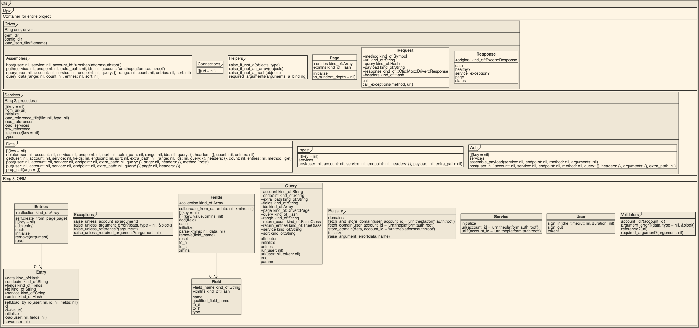
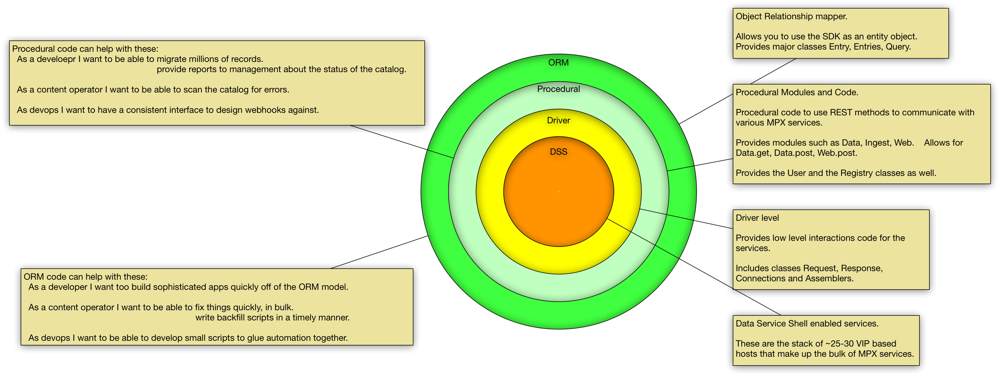

# Cts::Mpx

Ruby SDK for communicating with the REST services of MPX.

## Installation

Add this line to your application's Gemfile:

```ruby
gem 'cts-mpx'
```

And then execute:

    bundle

Or install it yourself as:

    gem install cts-mpx

## Usage

See EXAMPLES.md


## High level architecure

### Uml diagram



### SDK ring diagram



## Development

After checking out the repo, run `bin/setup` to install dependencies. Then, run `rake spec` to run the tests. You can also run `bin/console` for an interactive prompt that will allow you to experiment.

To install this gem onto your local machine, run `bundle exec rake install`. To release a new version, update the version number in `version.rb`, and then run `bundle exec rake release`, which will create a git tag for the version, push git commits and tags, and push the `.gem` file to [rubygems.org](https://rubygems.org).

## Contributing

1) fork
2) code
3) make specs
4) make sure your specs pass
5) make a pull request

## Copyright

Copyright 2018 Comcast Cable Communications Management, LLC
Licensed under the Apache License, Version 2.0 (the "License");
you may not use this file except in compliance with the License.
You may obtain a copy of the License at http://www.apache.org/licenses/LICENSE-2.0
Unless required by applicable law or agreed to in writing, software
distributed under the License is distributed on an "AS IS" BASIS,
WITHOUT WARRANTIES OR CONDITIONS OF ANY KIND, either express or implied.
See the License for the specific language governing permissions and
limitations under the License.